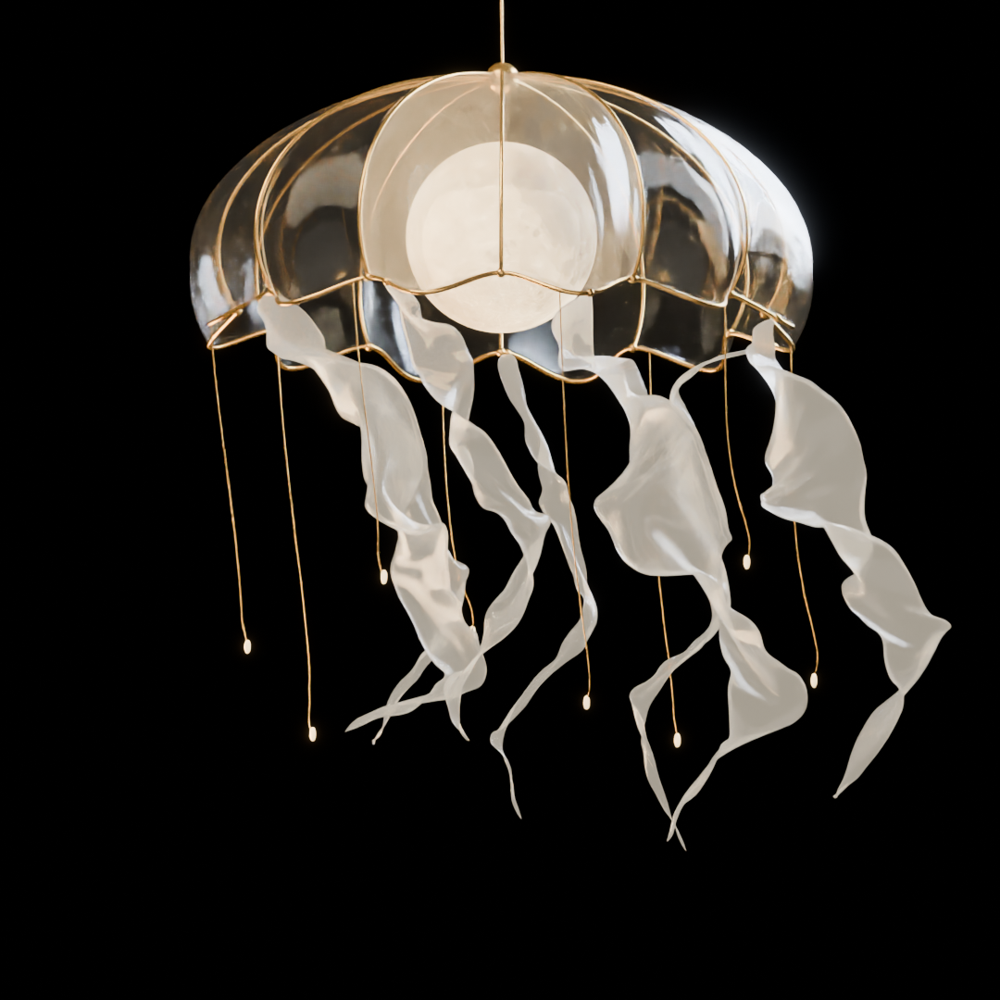

# 小松资产

**硅脑小松的模型、Blender 工程与创作代码资源库。**

把做出来的东西整理好，留下可学习、可复用的工程。

这个仓库保存资源介绍、预览图片、版本信息与下载链接。模型、Blender 工程、缓存、演示视频和代码压缩包通过 **Cloudflare R2** 分发，不将大文件塞进 Git 历史。

## 资产目录

### 满月水母灯

透明伞盖、发光月球和柔软触须组成的幻想灯具。使用 Blender 制作，包含布料与软体模拟的动画实验。

**当前：预览已公开，下载包尚未发布。** 公开下载地址和授权信息确认后，会在详情页更新。

[查看资产介绍 →](assets/moon-jellyfish-lamp/)

## 如何使用

1. 打开对应资产的介绍页，查看软件版本、内容、限制和授权。
2. 从介绍页的下载区获取需要的版本。完整工程请一起保留缓存、贴图等依赖。
3. 大文件下载失败时，先核对文件大小和 SHA-256，再通过 [Issues](https://github.com/dabidabi/xiaosong-assets/issues) 反馈。

资产独立迭代，不用重新下载整个仓库。尚未发布的条目不会提供虚构的下载链接。

## 目录与约定

- [`assets/`](assets/)：每项资产的介绍、预览和版本清单。
- [`catalog.json`](catalog.json)：机器可读目录，便于后续做检索和展示页。
- [`templates/`](templates/)：新增资产模板。
- [`docs/PUBLISHING.md`](docs/PUBLISHING.md)：发布、更新与核验流程。
- [`docs/LICENSING.md`](docs/LICENSING.md)：原创内容与第三方素材的授权规则。

## 授权与反馈

**公开可见不等于已经授予商用或再分发许可。** 每项资产以其详情页及下载包内的授权说明为准；统一授权方案尚在确认中。第三方素材始终保留各自的来源和许可，不因放入本仓库而改变。

作者：**硅脑小松**。欢迎提交使用反馈与复现问题。
